# 物联网第二次作业报告

软73 沈冠霖 2017013569

## 1.对给定的函数进行DFT

每个图上方都是波形，左右分别为numpy库自带的FFT和我自己实现的DFT的结果，根据奈奎斯特采样定理，为了显示效果良好，我只截取了左边半部分。

#### 常函数，N=16

#### 常函数，N=64

#### 常函数，N=1024

#### 线性函数，N=16

#### 线性函数，N=64

#### 线性函数，N=1024

#### 三角函数，N=16

#### 三角函数，N=64

#### 三角函数，N=1024

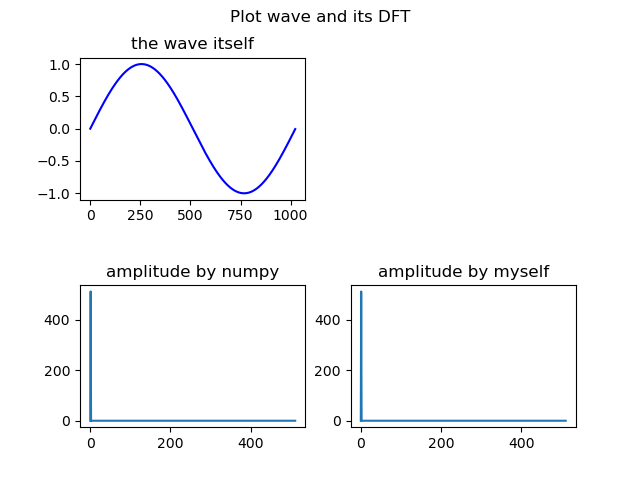

## 2.对res1进行DFT，STFT

首先是对res1进行DFT，波形如下：

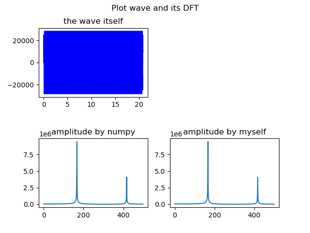

补0之后波形如下：

根据上面波形图，可以看出我的补0操作是正确的。之后看频谱图，发现频谱图的结构一致，推测补0不影响波的频率情况。

其次是对res1做短时傅里叶变换STFT

##### 窗口大小为16

##### 窗口大小为64

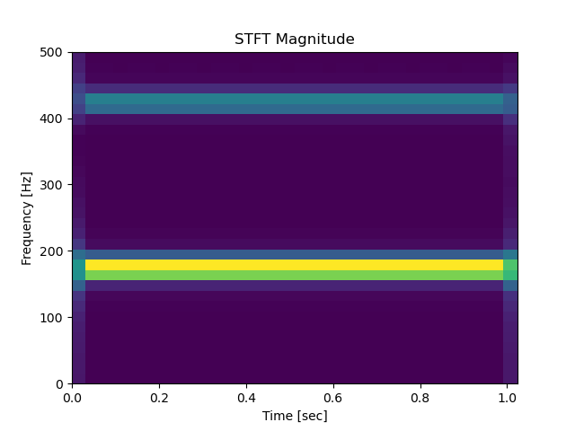

##### 窗口大小为256

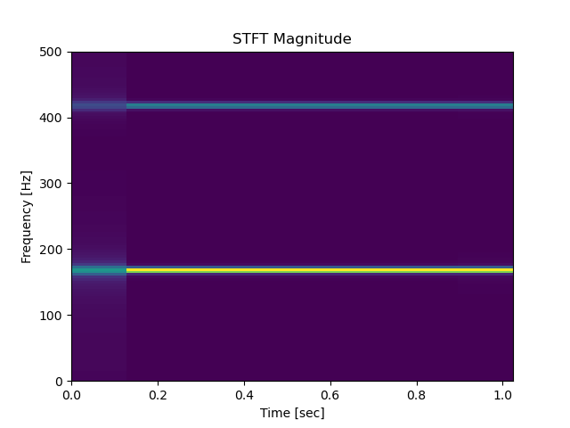

##### 窗口大小为1024

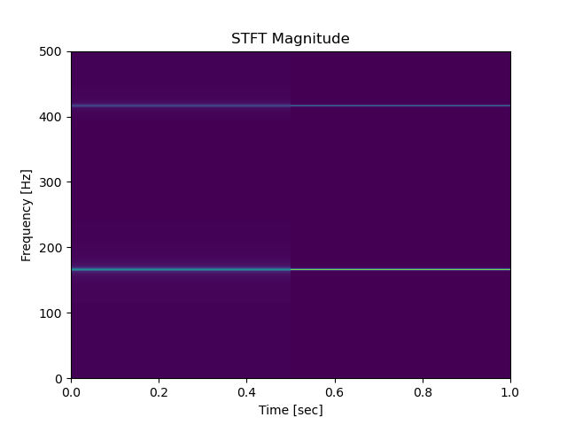

可以看出，首先，这个波的频率基本不随时间变化而变化，但是从256和1024可以看出这个波有一些噪声。其次，当窗口大小变大的时候，波的频率分布变得更加集中，但是受噪声影响也更大。

## 3.滤波

我先对res1进行低通滤波，结果如下

##### 窗口大小为3

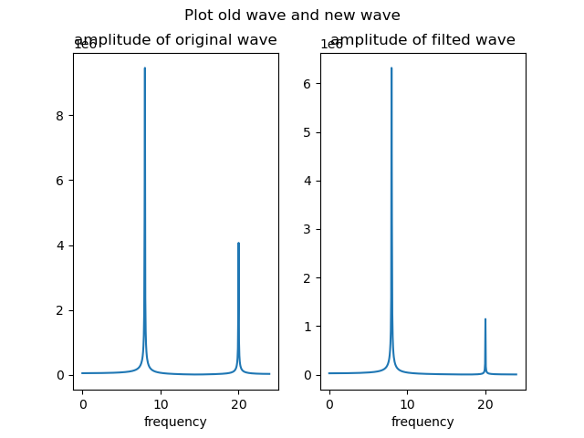

##### 窗口大小为4

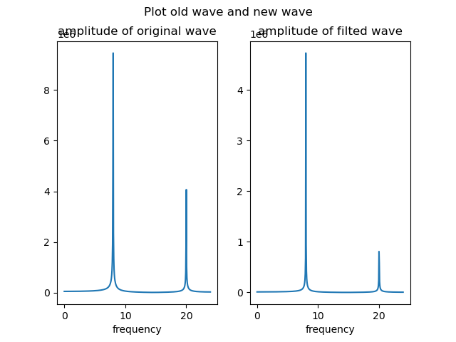

##### 窗口大小为8

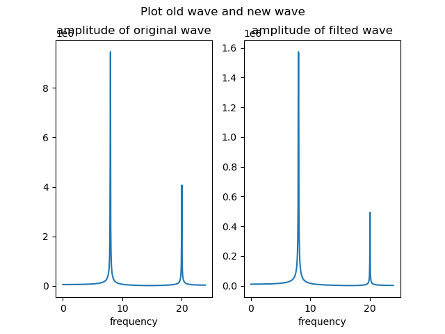

##### 窗口大小为16

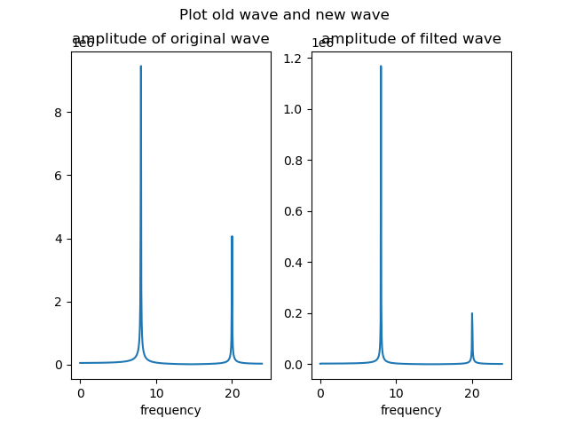

分析得到，窗口越大，滤波的绝对效果越强（高频波损失越大），但是对所需的低频波的损失也越大。滤波的相对效果（高频：低频）方面并没有明显规律，窗口大小从3变成4的时候滤波效果有所改进，4变成8滤波效果反而大幅下降，8变成16效果又明显提升。

之后对res2进行带通滤波，结果如下：

##### 17kHZ-18kHZ

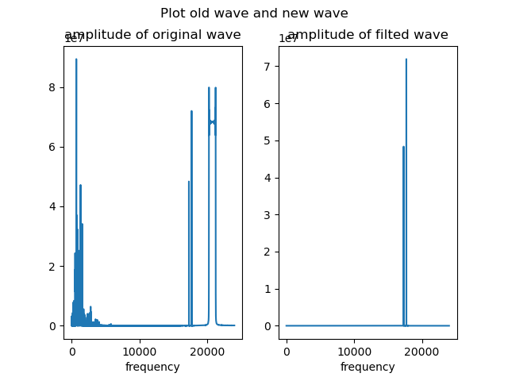

##### 20kHZ-21kHZ

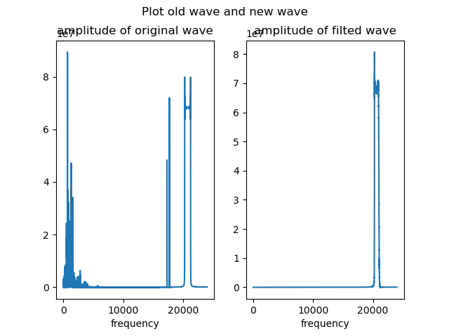

可以看出，两次滤波后，只有对应频率的部分留了下来且大小几乎不变，其余都滤掉了，说明滤波正确。